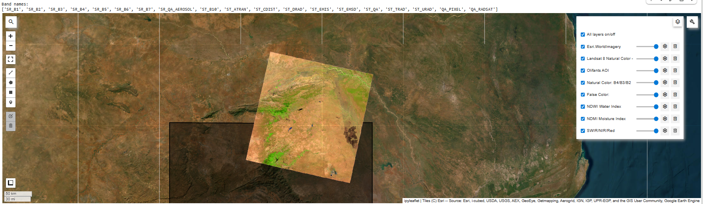
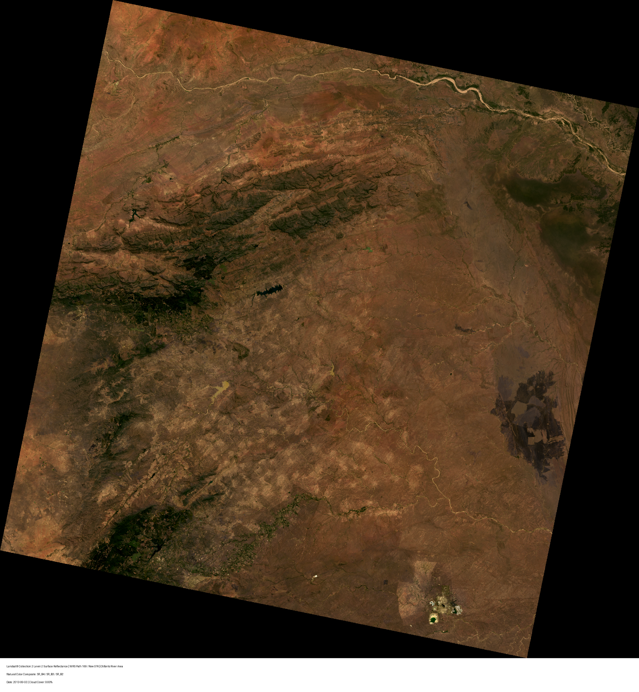

## Introduction

South African river monitoring depends on field measurements, but those measurements are limited to specific stations and dates. Satellite imagery cannot replace direct chemical sampling, but it can add spatial context by measuring surface conditions around rivers. This report asks whether Landsat-derived spectral features contain useful signal for explaining water-quality variation.

::: {.callout-note}
## Project and individual questions

**Overarching question (team):** What environmental, climatic, geographic, and land-use factors help explain degradation in South African river water quality from 2011--2015?

**My specific question:** Which Landsat-derived spectral bands and indices are most associated with total alkalinity, electrical conductance, and dissolved reactive phosphorus in South African rivers?
:::

The three chemistry targets represent different types of degradation. Total alkalinity and electrical conductance track dissolved minerals and salts. Dissolved reactive phosphorus is a nutrient pollutant tied to runoff, wastewater, agriculture, and land use. That distinction matters because these pollutants are not equally visible from surface reflectance. A strong report should therefore not simply ask whether Landsat "works." It should identify **where** Landsat is useful, **where** it fails, and **what ancillary evidence explains the pattern**.

This analysis treats Landsat features as proxy variables, not direct chemistry measurements. I (1) screen data quality for both recording and sampling problems, (2) explore the targets and their spatial structure, (3) estimate rank correlations between Landsat features and chemistry, (4) attach station-level cluster-bootstrap uncertainty, and (5) use the NASA POWER API to retrieve independent climate data and *formally test* whether the strongest Landsat signal (NDMI) behaves differently under dry versus wet conditions. The final step checks the interpretation that NDMI is capturing a moisture/dilution context rather than a spurious spectral artifact.

## Reproducibility Setup

The statistical analysis runs in R. The Landsat scene and band logic were verified in Google Earth Engine (Python/Colab), documented in @sec-gee.

```{r setup}
required_packages <- c(
  "tidyverse", "lubridate", "knitr", "kableExtra", "scales", "glue",
  "httr2", "jsonlite", "plotly", "DT", "leaflet", "crosstalk", "htmltools"
)

missing_packages <- required_packages[
  !(required_packages %in% rownames(installed.packages()))
]
if (length(missing_packages) > 0) {
  install.packages(missing_packages, repos = "https://cloud.r-project.org")
}
invisible(lapply(required_packages, library, character.only = TRUE))

theme_set(theme_minimal(base_size = 12))

dir.create("output/figures", showWarnings = FALSE, recursive = TRUE)
dir.create("output/tables", showWarnings = FALSE, recursive = TRUE)

base_url    <- "https://raw.githubusercontent.com/Snowflake-Labs/EY-AI-and-Data-Challenge/main"
water_url   <- paste0(base_url, "/water_quality_training_dataset.csv")
landsat_url <- paste0(base_url, "/landsat_features_training.csv")

set.seed(9750)
```

## Data Sources and Variables

Field chemistry and Landsat feature tables are read directly from public web-hosted CSV files [@challenge_repo]; the acquisition code below downloads them at render time, so nothing is read from a private local copy. I also query the NASA POWER monthly API for independent precipitation and temperature [@nasa_power_monthly; @nasa_power_daily], because NDMI is a moisture-related index and the central interpretation depends on moisture/dilution context. @tbl-dictionary lists the variables used.

```{r data-dictionary}
#| label: tbl-dictionary
#| tbl-cap: "Variables used in this report, grouped by role."
tibble::tribble(
  ~Variable,                        ~Role,              ~Description,
  "total_alkalinity",               "Target",           "Acid-neutralizing capacity (mineral/ionic).",
  "electrical_conductance",         "Target",           "Conductivity; proxy for dissolved salts.",
  "dissolved_reactive_phosphorus",  "Target",           "Bioavailable phosphorus; nutrient pollutant.",
  "green",                          "Landsat band",     "Surface reflectance, green.",
  "nir",                            "Landsat band",     "Surface reflectance, near-infrared.",
  "swir16 / swir22",                "Landsat band",     "Short-wave infrared (1.6 / 2.2 um).",
  "ndmi",                           "Landsat index",    "Normalized Difference Moisture Index (NIR, SWIR16).",
  "mndwi",                          "Landsat index",    "Modified Normalized Difference Water Index (Green, SWIR16).",
  "power_precip_mm",                "NASA POWER",       "Monthly corrected precipitation.",
  "power_t2m_c",                    "NASA POWER",       "Monthly 2 m air temperature."
) |>
  kbl() |>
  kable_styling(full_width = FALSE)
```

## Helper Functions

```{r helper-functions}
clean_colnames <- function(x) {
  x <- tolower(x)
  x <- gsub("[^a-z0-9]+", "_", x)
  gsub("^_+|_+$", "", x)
}

# Return the first matching column from a list of candidates, with a helpful
# error if none are present. Makes the pipeline robust to upstream renames.
pick_col <- function(df, candidates, label) {
  found <- candidates[candidates %in% names(df)]
  if (length(found) == 0) {
    stop(glue::glue(
      "Could not find column for {label}.\n",
      "Tried: {paste(candidates, collapse = ', ')}\n",
      "Available: {paste(names(df), collapse = ', ')}"
    ))
  }
  found[1]
}

# Try several date layouts and keep the parse that yields the fewest NAs.
parse_date_flexible <- function(x) {
  x <- as.character(x)
  candidates <- list(
    as.Date(x, "%d-%m-%Y"), as.Date(x, "%Y-%m-%d"),
    as.Date(x, "%m/%d/%Y"), as.Date(x, "%d/%m/%Y")
  )
  candidates[[which.min(sapply(candidates, \(d) sum(is.na(d))))]]
}

make_numeric <- function(x) {
  if (is.numeric(x)) return(x)
  as.numeric(gsub("[^0-9\\.\\-eE]", "", as.character(x)))
}

rename_if_exists <- function(df, old_names, new_name) {
  found <- old_names[old_names %in% names(df)]
  if (length(found) > 0) names(df)[names(df) == found[1]] <- new_name
  df
}

standardize_key_columns <- function(df, label) {
  lat  <- pick_col(df, c("latitude", "lat"), paste(label, "latitude"))
  lon  <- pick_col(df, c("longitude", "lon", "long"), paste(label, "longitude"))
  date <- pick_col(df, c("sample_date", "date", "sampling_date", "collection_date"),
                   paste(label, "date"))
  names(df)[names(df) == lat]  <- "latitude"
  names(df)[names(df) == lon]  <- "longitude"
  names(df)[names(df) == date] <- "sample_date"
  df$latitude    <- make_numeric(df$latitude)
  df$longitude   <- make_numeric(df$longitude)
  df$sample_date <- parse_date_flexible(df$sample_date)
  df
}

# Symmetric winsorizing used ONLY for the OLS predictive check, to limit the
# leverage of a few extreme records. Rank-based correlations are left on raw
# data because Spearman is already robust to outliers.
winsorize <- function(x, p = 0.01) {
  if (!is.numeric(x)) return(x)
  q <- quantile(x, c(p, 1 - p), na.rm = TRUE)
  pmin(pmax(x, q[1]), q[2])
}
```

## Data Acquisition, Cleaning, and Joining

```{r read-clean-join}
water   <- readr::read_csv(water_url,   show_col_types = FALSE)
landsat <- readr::read_csv(landsat_url, show_col_types = FALSE)

names(water)   <- clean_colnames(names(water))
names(landsat) <- clean_colnames(names(landsat))

water   <- standardize_key_columns(water,   "water-quality")
landsat <- standardize_key_columns(landsat, "Landsat")

alk_col  <- pick_col(water, c("total_alkalinity", "alkalinity", "ta"), "Total Alkalinity")
cond_col <- pick_col(water, c("electrical_conductance", "conductance", "ec"), "Electrical Conductance")
phos_col <- pick_col(water, c("dissolved_reactive_phosphorus", "reactive_phosphorus",
                              "phosphorus", "drp"), "Dissolved Reactive Phosphorus")
names(water)[names(water) == alk_col]  <- "total_alkalinity"
names(water)[names(water) == cond_col] <- "electrical_conductance"
names(water)[names(water) == phos_col] <- "dissolved_reactive_phosphorus"

targets <- c("total_alkalinity", "electrical_conductance", "dissolved_reactive_phosphorus")
target_labels <- c(
  total_alkalinity              = "Total Alkalinity",
  electrical_conductance        = "Electrical Conductance",
  dissolved_reactive_phosphorus = "Dissolved Reactive Phosphorus"
)
water <- water |> mutate(across(all_of(targets), make_numeric))

landsat <- landsat |>
  rename_if_exists(c("green", "band_green"), "green") |>
  rename_if_exists(c("nir", "nir08", "near_infrared"), "nir") |>
  rename_if_exists(c("swir16", "swir_16", "swir1", "swir_1"), "swir16") |>
  rename_if_exists(c("swir22", "swir_22", "swir2", "swir_2"), "swir22") |>
  rename_if_exists("ndmi", "ndmi") |>
  rename_if_exists("mndwi", "mndwi")

possible_features <- c("green", "nir", "swir16", "swir22", "ndmi", "mndwi")
landsat_features  <- possible_features[possible_features %in% names(landsat)]
landsat <- landsat |> mutate(across(all_of(landsat_features), make_numeric))

# Derive indices if the provider supplied bands but not indices.
eps <- 1e-10
if (!("ndmi" %in% names(landsat)) && all(c("nir", "swir16") %in% names(landsat))) {
  landsat <- landsat |> mutate(ndmi = (nir - swir16) / (nir + swir16 + eps))
}
if (!("mndwi" %in% names(landsat)) && all(c("green", "swir16") %in% names(landsat))) {
  landsat <- landsat |> mutate(mndwi = (green - swir16) / (green + swir16 + eps))
}
landsat_features <- possible_features[possible_features %in% names(landsat)]

feature_labels <- c(green = "Green", nir = "NIR", swir16 = "SWIR16",
                    swir22 = "SWIR22", ndmi = "NDMI", mndwi = "MNDWI")

analysis_data <- water |>
  left_join(landsat, by = c("latitude", "longitude", "sample_date")) |>
  mutate(
    station_id = paste(round(latitude, 6), round(longitude, 6), sep = "_"),
    year       = lubridate::year(sample_date),
    month      = lubridate::month(sample_date)
  )
```

Cleaning standardizes names, dates, coordinates, targets, and features before any analysis. The join is on latitude, longitude, **and** sample date: the question is not whether high-reflectance locations have high chemistry, but whether matched station-date observations align.

## Landsat Scene Verification {#sec-gee}

The statistical analysis uses the tabular features distributed with the challenge, but I independently verified the satellite source and band logic in Google Earth Engine. The workflow loads Landsat 8 Collection 2 Level-2 surface reflectance, masks clouds and shadows from `QA_PIXEL`, applies the Collection-2 scaling factors, derives NDMI and MNDWI from the NIR/SWIR/Green bands, and samples values at each monitoring point within an 8-day window of the sample date [@gee_landsat8_c2_l2]. @fig-gee-layers documents the layer setup; @fig-gee-clean shows a clean natural-color scene.

```{r landsat-layer-proof}
#| label: fig-gee-layers
#| echo: false
#| out-width: "90%"
#| fig-cap: "Google Earth Engine / Colab verification view documenting the Landsat natural-color scene, NDMI/NDWI/SWIR layers, and Olifants scene context."

```

```{r landsat-clean-image}
#| label: fig-gee-clean
#| echo: false
#| out-width: "75%"
#| fig-cap: "Clean Landsat 8 natural-color context image for WRS Path 169 / Row 076 in the Olifants River area (SR_B4/SR_B3/SR_B2 as RGB)."

```

The Python below is the GEE extraction pipeline (run in Colab, shown as documentation; it is not executed during R rendering). It is the procedure that turns raw imagery into the per-station spectral features analyzed here.

```python
# Run in Google Colab. Documentation only; not executed during Quarto render.
import ee, pandas as pd
ee.Authenticate(); ee.Initialize()

AOI = ee.Geometry.Rectangle([28.3, -25.8, 31.8, -23.2])   # Olifants basin
START, END = "2011-01-01", "2015-12-31"

def mask_and_scale(img):
    qa = img.select("QA_PIXEL")
    clear = qa.bitwiseAnd(1 << 3).eq(0).And(qa.bitwiseAnd(1 << 4).eq(0))  # no cloud/shadow
    sr = img.select("SR_B.").multiply(2.75e-05).add(-0.2)                 # C2 L2 scaling
    return img.addBands(sr, None, True).updateMask(clear)

def add_indices(img):
    green, nir = img.select("SR_B3"), img.select("SR_B5")
    sw16, sw22 = img.select("SR_B6"), img.select("SR_B7")
    ndmi  = nir.subtract(sw16).divide(nir.add(sw16)).rename("ndmi")
    mndwi = green.subtract(sw16).divide(green.add(sw16)).rename("mndwi")
    return (img.addBands([ndmi, mndwi])
               .select(["SR_B3", "SR_B5", "SR_B6", "SR_B7", "ndmi", "mndwi"],
                       ["green", "nir", "swir16", "swir22", "ndmi", "mndwi"]))

coll = (ee.ImageCollection("LANDSAT/LC08/C02/T1_L2")
        .filterBounds(AOI).filterDate(START, END)
        .filter(ee.Filter.lt("CLOUD_COVER", 30))
        .map(mask_and_scale).map(add_indices))

# `stations` is an ee.FeatureCollection with a 'sample_date' property + geometry.
def sample_station(feat):
    pt = feat.geometry(); d = ee.Date(feat.get("sample_date"))
    img = (coll.filterDate(d.advance(-8, "day"), d.advance(8, "day"))
               .filterBounds(pt).sort("CLOUD_COVER").first())
    vals = ee.Image(img).reduceRegion(ee.Reducer.mean(), pt, 30)
    return feat.set(vals)

features = stations.map(sample_station)
# ee.batch.Export.table.toDrive(features, "landsat_features_training", fileFormat="CSV").start()
```

## Data Quality: Recording and Sampling {#sec-quality}

I assess quality on two axes. **Recording quality** (@tbl-qc) asks whether the recorded values are plausible: chemistry should be non-negative, and NDMI/MNDWI must lie in [-1, 1]. I also count extreme records using a robust median +/- 5x MAD rule. **Sampling quality** (@tbl-sampling) asks whether the satellite-complete subset is representative: because I analyze only station-dates with usable imagery, I test whether those rows differ systematically from rows missing Landsat coverage.

```{r qc-recording}
#| label: tbl-qc
#| tbl-cap: "Recording-quality screen for targets and Landsat features."
qc <- map_dfr(c(targets, landsat_features), function(v) {
  x   <- analysis_data[[v]]
  med <- median(x, na.rm = TRUE)
  tibble(
    Variable      = v,
    `Non-missing` = sum(!is.na(x)),
    Min           = round(min(x, na.rm = TRUE), 3),
    Median        = round(med, 3),
    Max           = round(max(x, na.rm = TRUE), 3),
    `Non-positive`= if (v %in% targets) sum(x <= 0, na.rm = TRUE) else NA_integer_,
    `Out of [-1,1]`= if (v %in% c("ndmi", "mndwi")) sum(x < -1 | x > 1, na.rm = TRUE) else NA_integer_,
    `Extreme (5*MAD)` = sum(abs(x - med) > 5 * mad(x, na.rm = TRUE), na.rm = TRUE)
  )
})
write_csv(qc, "output/tables/recording_quality.csv")
qc |> kbl() |> kable_styling(full_width = FALSE, font_size = 12)
```

```{r qc-sampling}
#| label: tbl-sampling
#| tbl-cap: "Sampling representativeness: are satellite-complete rows different from rows missing Landsat coverage? (Wilcoxon rank-sum)."
sampling_quality <- map_dfr(targets, function(t) {
  d   <- analysis_data |> transmute(has_landsat = !is.na(ndmi), val = .data[[t]]) |> drop_na(val)
  med <- tapply(d$val, d$has_landsat, median)
  p   <- suppressWarnings(wilcox.test(val ~ has_landsat, data = d)$p.value)
  tibble(target = t,
         `Median (Landsat present)` = round(med["TRUE"], 2),
         `Median (Landsat missing)` = round(med["FALSE"], 2),
         `Wilcoxon p` = signif(p, 3))
}) |>
  mutate(Target = recode(target, !!!target_labels), .keep = "unused", .before = 1)
write_csv(sampling_quality, "output/tables/sampling_quality.csv")
sampling_quality |> kbl() |> kable_styling(full_width = FALSE)
```

The recording screen finds chemistry values within plausible positive ranges and indices inside [-1, 1], with only a small tail of MAD-extreme records (handled later by winsorizing in the OLS check only). The sampling test is the more important caveat: where the Wilcoxon p-value is small, the satellite-complete subset is **not** a perfectly neutral sample of all station-dates, so correlations describe the imaged subset and should be read with that selection in mind.

## Exploratory Data Analysis {#sec-eda}

@fig-dist shows that all three targets are strongly right-skewed, which is exactly why rank-based Spearman correlation is the primary tool: a few large values would otherwise dominate a Pearson estimate. @fig-missing shows that the targets are complete after joining while Landsat features are not, and @fig-spatial shows how alkalinity varies across the monitoring network.

```{r eda-distributions}
#| label: fig-dist
#| fig-cap: "Target distributions on raw (top) and log10 (bottom) scales. Heavy right skew motivates rank-based analysis."
#| fig-width: 9
#| fig-height: 5
base_dist <- analysis_data |>
  select(all_of(targets)) |>
  pivot_longer(everything(), names_to = "target", values_to = "value") |>
  filter(is.finite(value)) |>
  mutate(target = recode(target, !!!target_labels))

dist_both <- bind_rows(
  base_dist |> transmute(target, scale = "Raw",   v = value),
  base_dist |> filter(value > 0) |> transmute(target, scale = "log10", v = log10(value))
) |>
  mutate(scale = factor(scale, levels = c("Raw", "log10")))

dist_plot <- ggplot(dist_both, aes(v, fill = scale)) +
  geom_histogram(bins = 40, alpha = 0.85, show.legend = FALSE) +
  facet_grid(scale ~ target, scales = "free") +
  scale_fill_manual(values = c(Raw = "#2166ac", log10 = "#b2182b")) +
  labs(x = "Value", y = "Count")
dist_plot
ggsave("output/figures/target_distributions.png", dist_plot, width = 9, height = 5)
```

```{r missingness-plot}
#| label: fig-missing
#| fig-cap: "Missingness by analysis variable. Chemistry targets are complete in the joined table; Landsat features are not."
#| fig-width: 8
#| fig-height: 4.4
missingness <- tibble(
  variable      = c(landsat_features, targets),
  missing_pct   = map_dbl(c(landsat_features, targets), ~ mean(is.na(analysis_data[[.x]]))),
  variable_type = if_else(c(landsat_features, targets) %in% landsat_features,
                          "Landsat feature", "Water-quality target")
)
write_csv(missingness, "output/tables/missingness_by_variable.csv")

missingness_plot <- missingness |>
  mutate(variable = fct_reorder(variable, missing_pct)) |>
  ggplot(aes(missing_pct, variable, fill = variable_type)) +
  geom_col(width = 0.75) +
  scale_x_continuous(labels = percent_format(accuracy = 1)) +
  labs(title = "Missingness by Analysis Variable", x = "Percent missing",
       y = NULL, fill = NULL) +
  theme(legend.position = "bottom")
missingness_plot
ggsave("output/figures/missingness_plot.png", missingness_plot, width = 8, height = 4.4)
```

```{r eda-spatial}
#| label: fig-spatial
#| fig-cap: "Monitoring stations colored by median total alkalinity. Spatial clustering of high-alkalinity stations suggests regional structure beyond any single spectral band."
#| fig-width: 7.5
#| fig-height: 6
station_summary <- analysis_data |>
  group_by(station_id, latitude, longitude) |>
  summarize(
    n_obs               = n(),
    median_alkalinity   = median(total_alkalinity, na.rm = TRUE),
    median_conductance  = median(electrical_conductance, na.rm = TRUE),
    median_phosphorus   = median(dissolved_reactive_phosphorus, na.rm = TRUE),
    median_ndmi         = median(ndmi, na.rm = TRUE),
    .groups = "drop"
  )

spatial_plot <- ggplot(station_summary, aes(longitude, latitude, color = median_alkalinity)) +
  geom_point(aes(size = n_obs), alpha = 0.8) +
  scale_color_viridis_c(option = "magma", direction = -1, name = "Median\nalkalinity") +
  scale_size_continuous(range = c(1, 5), name = "Samples") +
  coord_quickmap() +
  labs(title = "Monitoring Stations by Median Alkalinity",
       x = "Longitude", y = "Latitude")
spatial_plot
ggsave("output/figures/station_spatial.png", spatial_plot, width = 7.5, height = 6)
```

## Interactive Station Explorer {#sec-explorer}

The widget below links a map, a sortable/exportable table, and a scatter of station-level NDMI versus alkalinity. Filtering by sample count or selecting points updates all three views; the table's buttons export the current selection. All data are public and processed in your browser.

```{r interactive-dashboard}
#| echo: false
sd <- crosstalk::SharedData$new(station_summary, key = ~station_id)

pal <- leaflet::colorNumeric("YlOrRd", domain = station_summary$median_alkalinity)

map <- leaflet::leaflet(sd, height = 420) |>
  leaflet::addProviderTiles(leaflet::providers$CartoDB.Positron) |>
  leaflet::addCircleMarkers(
    radius = 5, stroke = FALSE, fillOpacity = 0.85,
    color = ~pal(median_alkalinity),
    popup = ~paste0("Station: ", station_id,
                    "<br>Median alkalinity: ", round(median_alkalinity, 1),
                    "<br>Median NDMI: ", round(median_ndmi, 3),
                    "<br>Samples: ", n_obs)) |>
  leaflet::addLegend("bottomright", pal = pal, values = ~median_alkalinity,
                     title = "Median<br>alkalinity")

tbl <- DT::datatable(
  sd, rownames = FALSE, extensions = "Buttons",
  colnames = c("Station", "Lat", "Lon", "Samples", "Alkalinity",
               "Conductance", "Phosphorus", "NDMI"),
  options = list(dom = "Bfrtip", buttons = c("copy", "csv", "excel"),
                 pageLength = 8, scrollX = TRUE)) |>
  DT::formatRound(c("median_alkalinity", "median_conductance",
                    "median_phosphorus", "median_ndmi"), 2)

scatter <- plotly::plot_ly(
  sd, x = ~median_ndmi, y = ~median_alkalinity, type = "scatter", mode = "markers",
  marker = list(size = 8, opacity = 0.7),
  text = ~paste0("Station ", station_id, "<br>Samples: ", n_obs),
  hoverinfo = "text") |>
  plotly::layout(xaxis = list(title = "Median NDMI"),
                 yaxis = list(title = "Median total alkalinity"))

htmltools::browsable(htmltools::tagList(
  crosstalk::filter_slider("nobs", "Minimum samples per station", sd, ~n_obs, step = 1),
  crosstalk::bscols(widths = c(5, 7), map, tbl),
  scatter
))
```

## Main Analysis: Landsat Correlations {#sec-main}

Spearman correlation is the primary measure because reflectance-chemistry relationships can be monotonic without being linear (consistent with the skew in @fig-dist); Pearson is reported as a secondary check. @tbl-corr ranks the top features per target, and @fig-heat shows the full matrix.

```{r correlations}
#| label: tbl-corr
#| tbl-cap: "Top Landsat features per target, ranked by absolute Spearman correlation."
corr_table <- expand_grid(target = targets, feature = landsat_features) |>
  mutate(
    n_complete  = map2_int(target, feature, ~ sum(complete.cases(analysis_data[[.x]], analysis_data[[.y]]))),
    spearman_r  = map2_dbl(target, feature, ~ cor(analysis_data[[.x]], analysis_data[[.y]], method = "spearman",  use = "complete.obs")),
    pearson_r   = map2_dbl(target, feature, ~ cor(analysis_data[[.x]], analysis_data[[.y]], method = "pearson", use = "complete.obs")),
    abs_spearman = abs(spearman_r),
    target_label  = recode(target,  !!!target_labels),
    feature_label = recode(feature, !!!feature_labels)
  ) |>
  arrange(target, desc(abs_spearman))

top_features <- corr_table |>
  group_by(target) |>
  slice_max(abs_spearman, n = 3, with_ties = FALSE) |>
  ungroup()

write_csv(corr_table,  "output/tables/landsat_correlations.csv")
write_csv(top_features, "output/tables/top_landsat_features.csv")

top_features |>
  transmute(Target = target_label, `Landsat feature` = feature_label,
            `Complete pairs` = n_complete,
            `Spearman r` = round(spearman_r, 3), `Pearson r` = round(pearson_r, 3)) |>
  kbl() |>
  kable_styling(full_width = FALSE)
```

```{r heatmap}
#| label: fig-heat
#| fig-cap: "Spearman correlations between Landsat features and water-quality targets."
#| fig-width: 8
#| fig-height: 4.4
heatmap_plot <- corr_table |>
  mutate(feature_label = factor(feature_label, levels = feature_labels[landsat_features]),
         target_label  = factor(target_label,  levels = target_labels[targets])) |>
  ggplot(aes(feature_label, target_label, fill = spearman_r)) +
  geom_tile(color = "white", linewidth = 0.8) +
  geom_text(aes(label = sprintf("%.2f", spearman_r)), size = 4) +
  scale_fill_gradient2(low = "#2166ac", mid = "white", high = "#b2182b",
                       midpoint = 0, limits = c(-0.30, 0.30), name = "Spearman r") +
  labs(title = "Landsat Features vs. Water-Quality Targets",
       subtitle = "NDMI is strongest for alkalinity and conductance; phosphorus stays near zero",
       x = "Landsat feature", y = NULL) +
  theme(panel.grid = element_blank())
heatmap_plot
ggsave("output/figures/landsat_correlation_heatmap.png", heatmap_plot, width = 8, height = 4.4)
```

The pattern is pollutant-specific. NDMI is the strongest feature for total alkalinity and electrical conductance, while dissolved reactive phosphorus stays near zero across every tested feature. This directly answers the specific question: Landsat's moisture and infrared signals are more useful for ionic/mineral chemistry than for phosphorus.

## Bootstrap Uncertainty {#sec-bootstrap}

A single correlation can be unstable, and observations repeat within stations, so I use a **station-level cluster bootstrap**: each replicate resamples stations with replacement and keeps all observations from sampled stations (preserving within-station dependence). The implementation pre-splits by station so 1,000 replicates run quickly.

```{r bootstrap}
#| label: tbl-boot
#| tbl-cap: "Station-level cluster-bootstrap 95% intervals for the strongest feature per target."
cluster_boot_spearman <- function(data, target, feature, B = 1000) {
  df <- data |> transmute(station_id, x = .data[[target]], y = .data[[feature]]) |> drop_na()
  by_station <- split(df, df$station_id)
  stations   <- names(by_station)
  boot <- replicate(B, {
    samp <- sample(stations, length(stations), replace = TRUE)
    bd   <- do.call(rbind, by_station[samp])   # repeated names -> correct multiplicity
    suppressWarnings(cor(bd$x, bd$y, method = "spearman"))
  })
  tibble(target, feature,
         estimate  = cor(df$x, df$y, method = "spearman"),
         conf_low  = quantile(boot, 0.025, na.rm = TRUE),
         conf_high = quantile(boot, 0.975, na.rm = TRUE),
         n = nrow(df), stations = length(stations))
}

set.seed(9750)
top_one <- corr_table |> group_by(target) |>
  slice_max(abs_spearman, n = 1, with_ties = FALSE) |> ungroup()

bootstrap_results <- pmap_dfr(list(top_one$target, top_one$feature),
                              ~ cluster_boot_spearman(analysis_data, ..1, ..2)) |>
  mutate(target_label = recode(target, !!!target_labels),
         feature_label = recode(feature, !!!feature_labels))
write_csv(bootstrap_results, "output/tables/bootstrap_spearman_ci.csv")

bootstrap_results |>
  transmute(Target = target_label, `Top feature` = feature_label,
            Estimate = round(estimate, 3),
            `95% CI lower` = round(conf_low, 3), `95% CI upper` = round(conf_high, 3),
            `Complete rows` = n, Stations = stations) |>
  kbl() |> kable_styling(full_width = FALSE)
```

```{r bootstrap-plot}
#| label: fig-boot
#| fig-cap: "Cluster-bootstrap 95% intervals around the strongest Landsat relationship per target."
#| fig-width: 8
#| fig-height: 4
bootstrap_plot <- bootstrap_results |>
  mutate(target_label = fct_reorder(target_label, estimate)) |>
  ggplot(aes(y = target_label)) +
  geom_vline(xintercept = 0, linetype = "dashed", color = "gray50") +
  geom_segment(aes(x = conf_low, xend = conf_high, yend = target_label), linewidth = 1) +
  geom_point(aes(x = estimate), size = 3) +
  labs(title = "Uncertainty Around the Strongest Landsat Relationship per Target",
       subtitle = "Station-level cluster bootstrap, 1,000 replicates",
       x = "Spearman correlation", y = NULL)
bootstrap_plot
ggsave("output/figures/bootstrap_correlation_intervals.png", bootstrap_plot, width = 8, height = 4)
```

The intervals confirm a modest but real signal: the NDMI relationships for alkalinity and conductance are negative and exclude zero, while the phosphorus interval straddles zero. Landsat contains useful **but limited** signal, strongest for mineral-related indicators.

## Ancillary Climate Check Using the NASA POWER API {#sec-power}

Because NDMI is a moisture index, its strongest relationships should be checked against independent climate data. I query the NASA POWER monthly API once per rounded 0.5-degree grid cell (not once per row), cache the result, and join monthly precipitation/temperature back to each observation.

```{r nasa-power-api}
#| label: tbl-power-acq
#| tbl-cap: "NASA POWER API acquisition summary."
fetch_power_monthly_point <- function(lat, lon, start_year = 2011, end_year = 2015,
                                       params = c("PRECTOTCORR", "T2M")) {
  resp <- httr2::request("https://power.larc.nasa.gov/api/temporal/monthly/point") |>
    httr2::req_url_query(parameters = paste(params, collapse = ","), community = "AG",
                         longitude = lon, latitude = lat, format = "JSON",
                         start = start_year, end = end_year) |>
    httr2::req_perform()
  obj <- jsonlite::fromJSON(httr2::resp_body_string(resp), simplifyVector = FALSE)
  pl  <- obj$properties$parameter
  if (is.null(pl)) stop("NASA POWER response did not include parameter data.")
  purrr::map_dfr(names(pl), \(p) tibble(ym = names(pl[[p]]), parameter = p,
                                        value = as.numeric(unlist(pl[[p]])))) |>
    pivot_wider(names_from = parameter, values_from = value) |>
    mutate(year = as.integer(substr(ym, 1, 4)), month = as.integer(substr(ym, 5, 6)),
           lat_cell = lat, lon_cell = lon)
}

power_cache <- "output/tables/nasa_power_monthly_cache.csv"
station_grid <- analysis_data |>
  distinct(latitude, longitude) |>
  mutate(lat_cell = round(latitude * 2) / 2, lon_cell = round(longitude * 2) / 2) |>
  distinct(lat_cell, lon_cell) |> arrange(lat_cell, lon_cell)

if (file.exists(power_cache)) {
  power_monthly <- readr::read_csv(power_cache, show_col_types = FALSE)
} else {
  power_monthly <- purrr::pmap_dfr(station_grid, function(lat_cell, lon_cell) {
    Sys.sleep(0.15)
    tryCatch(fetch_power_monthly_point(lat_cell, lon_cell),
             error = function(e) { warning(e$message); tibble() })
  })
  readr::write_csv(power_monthly, power_cache)
}

names(power_monthly) <- clean_colnames(names(power_monthly))
power_monthly <- power_monthly |>
  rename_if_exists("prectotcorr", "power_precip_mm") |>
  rename_if_exists("t2m", "power_t2m_c")

analysis_power <- analysis_data |>
  mutate(lat_cell = round(latitude * 2) / 2, lon_cell = round(longitude * 2) / 2) |>
  left_join(power_monthly |> select(lat_cell, lon_cell, year, month,
                                    power_precip_mm, power_t2m_c),
            by = c("lat_cell", "lon_cell", "year", "month"))

tibble(`Grid cells requested` = nrow(station_grid),
       `Rows with precipitation` = sum(!is.na(analysis_power$power_precip_mm)),
       `Join rate` = percent(mean(!is.na(analysis_power$power_precip_mm)), accuracy = 0.1)) |>
  kbl() |> kable_styling(full_width = FALSE)
```

```{r climate-stratified-correlations}
#| label: tbl-strat
#| tbl-cap: "NDMI Spearman correlations by NASA POWER monthly precipitation tercile."
analysis_power <- analysis_power |>
  mutate(precip_group = factor(case_when(
           ntile(power_precip_mm, 3) == 1 ~ "Dry months",
           ntile(power_precip_mm, 3) == 2 ~ "Middle months",
           ntile(power_precip_mm, 3) == 3 ~ "Wet months"),
         levels = c("Dry months", "Middle months", "Wet months")))

ndmi_stratified <- analysis_power |>
  select(precip_group, ndmi, all_of(targets)) |>
  pivot_longer(all_of(targets), names_to = "target", values_to = "chemistry") |>
  group_by(precip_group, target) |>
  summarize(n_complete = sum(complete.cases(chemistry, ndmi)),
            spearman_r = { g <- complete.cases(chemistry, ndmi)
              if (sum(g) >= 10) cor(chemistry[g], ndmi[g], method = "spearman") else NA_real_ },
            .groups = "drop") |>
  mutate(target_label = recode(target, !!!target_labels)) |>
  filter(!is.na(precip_group))
write_csv(ndmi_stratified, "output/tables/ndmi_correlations_by_precip_group.csv")

# helper for inline references in the prose below
get_r <- function(grp, tgt) ndmi_stratified |>
  filter(precip_group == grp, target == tgt) |> pull(spearman_r)

ndmi_stratified |>
  transmute(`Precipitation group` = precip_group, Target = target_label,
            `Complete pairs` = n_complete, `NDMI Spearman r` = round(spearman_r, 3)) |>
  kbl() |> kable_styling(full_width = FALSE)
```

```{r climate-stratified-plot}
#| label: fig-strat
#| fig-cap: "NDMI relationship with each target across independent precipitation terciles (interactive: hover for exact values)."
#| fig-width: 8
#| fig-height: 4.4
stratified_plot <- ndmi_stratified |>
  ggplot(aes(precip_group, spearman_r, group = target_label, color = target_label,
             text = paste0(target_label, "<br>", precip_group, "<br>r = ", round(spearman_r, 3)))) +
  geom_hline(yintercept = 0, linetype = "dashed", color = "gray50") +
  geom_line(aes(group = target_label), linewidth = 0.9) +
  geom_point(size = 3) +
  labs(title = "NDMI Relationship by Independent Precipitation Context",
       x = NULL, y = "Spearman correlation with NDMI", color = "Target") +
  theme(legend.position = "bottom")
ggsave("output/figures/ndmi_by_precipitation_group.png", stratified_plot, width = 8, height = 4.4)
plotly::ggplotly(stratified_plot, tooltip = "text")
```

^ I formally test whether the NDMI relationship is *modified* by precipitation. @tbl-diff reports the dry-minus-wet difference in NDMI correlation for the two ionic targets, with a station-level cluster-bootstrap interval.

```{r diff-in-correlation}
#| label: tbl-diff
#| tbl-cap: "Dry-minus-wet difference in NDMI Spearman correlation, with cluster-bootstrap 95% CI. An interval excluding 0 indicates moisture modifies the relationship."
boot_diff_spearman <- function(data, target, feature, gA, gB, B = 1000) {
  d <- data |> transmute(station_id, grp = precip_group, x = .data[[target]], y = .data[[feature]]) |>
    drop_na() |> filter(grp %in% c(gA, gB))
  by_st <- split(d, d$station_id); stations <- names(by_st)
  diff_one <- function(df) {
    a <- df[df$grp == gA, ]; b <- df[df$grp == gB, ]
    if (nrow(a) < 10 || nrow(b) < 10) return(NA_real_)
    cor(a$x, a$y, method = "spearman") - cor(b$x, b$y, method = "spearman")
  }
  boot <- replicate(B, {
    samp <- sample(stations, length(stations), replace = TRUE)
    suppressWarnings(diff_one(do.call(rbind, by_st[samp])))
  })
  tibble(target, feature, diff_estimate = diff_one(d),
         conf_low = quantile(boot, 0.025, na.rm = TRUE),
         conf_high = quantile(boot, 0.975, na.rm = TRUE))
}

set.seed(9750)
diff_results <- map_dfr(c("total_alkalinity", "electrical_conductance"),
                        ~ boot_diff_spearman(analysis_power, .x, "ndmi",
                                             "Dry months", "Wet months")) |>
  mutate(target_label = recode(target, !!!target_labels))
write_csv(diff_results, "output/tables/ndmi_dry_wet_difference.csv")

diff_results |>
  transmute(Target = target_label, `Dry - Wet difference` = round(diff_estimate, 3),
            `95% CI lower` = round(conf_low, 3), `95% CI upper` = round(conf_high, 3)) |>
  kbl() |> kable_styling(full_width = FALSE)
```

The pattern is consistent with dilution. The NDMI--alkalinity relationship is strongest in **dry** months (r `r round(get_r("Dry months","total_alkalinity"), 2)`) and weakest in **wet/middle** months (r `r round(get_r("Wet months","total_alkalinity"), 2)`); electrical conductance follows the same direction. When water is scarce (low moisture, low NDMI), dissolved minerals concentrate, so the negative NDMI--mineral link tightens; rain dilutes that signal. Phosphorus stays weak in every tercile (|r| around `r round(abs(get_r("Dry months","dissolved_reactive_phosphorus")), 2)`), so the failure to detect it is **not** a moisture artifact. The cluster-bootstrap differences in @tbl-diff quantify whether this dry-vs-wet shift is larger than sampling noise rather than asserting it from point estimates alone.

## Predictive Check: Does Independent Climate Add Information? {#sec-pred}

This diagnostic asks a single SQ-relevant question: are Landsat features alone sufficient, or does independent climate context add predictive value? I compare repeated train/test OLS models (Landsat-only vs. Landsat + NASA POWER), winsorizing inputs at 1% to limit leverage. It is a diagnostic, not the team's final model.

```{r model-check}
#| label: fig-model
#| fig-cap: "Out-of-sample R-squared (30 train/test splits): adding independent climate context to Landsat features."
#| fig-width: 8
#| fig-height: 3.6
model_cv <- function(data, target, predictors, n_splits = 30, train_prop = 0.70) {
  df <- data |> select(all_of(c(target, predictors))) |> drop_na() |>
    mutate(across(everything(), winsorize))
  if (nrow(df) < 100) return(tibble())
  map_dfr(seq_len(n_splits), function(i) {
    idx   <- sample(nrow(df), floor(train_prop * nrow(df)))
    fit   <- lm(reformulate(predictors, target), data = df[idx, ])
    pred  <- predict(fit, df[-idx, ]); actual <- df[[target]][-idx]
    tibble(rmse = sqrt(mean((actual - pred)^2)),
           r_squared = 1 - sum((actual - pred)^2) / sum((actual - mean(actual))^2))
  }) |> mutate(target = target)
}

set.seed(9750)
climate_predictors <- c("power_precip_mm", "power_t2m_c")
model_results <- map_dfr(targets, function(t) bind_rows(
  model_cv(analysis_power, t, landsat_features) |> mutate(model = "Landsat only"),
  model_cv(analysis_power, t, c(landsat_features, climate_predictors)) |> mutate(model = "Landsat + climate"))) |>
  mutate(target_label = recode(target, !!!target_labels))

model_summary <- model_results |>
  group_by(target_label, model) |>
  summarize(mean_rmse = mean(rmse), mean_r2 = mean(r_squared),
            sd_r2 = sd(r_squared), .groups = "drop")
write_csv(model_summary, "output/tables/model_summary_landsat_vs_climate.csv")

model_wide <- model_summary |> select(target_label, model, mean_r2) |>
  pivot_wider(names_from = model, values_from = mean_r2)

model_plot <- ggplot(model_wide, aes(y = fct_reorder(target_label, `Landsat + climate`))) +
  geom_segment(aes(x = `Landsat only`, xend = `Landsat + climate`,
                   yend = target_label), color = "gray70", linewidth = 1.4) +
  geom_point(aes(x = `Landsat only`, color = "Landsat only"), size = 4) +
  geom_point(aes(x = `Landsat + climate`, color = "Landsat + climate"), size = 4) +
  scale_color_manual(values = c("Landsat only" = "#2166ac", "Landsat + climate" = "#b2182b"),
                     name = NULL) +
  labs(title = "Climate Context Roughly Doubles Explained Variance for Ionic Targets",
       subtitle = "Phosphorus stays near zero R-squared even with climate added",
       x = "Mean out-of-sample R-squared", y = NULL) +
  theme(legend.position = "bottom")
model_plot
ggsave("output/figures/model_improvement.png", model_plot, width = 8, height = 3.6)
```

The result is clean and on-topic. Adding two independent climate variables roughly doubles out-of-sample R-squared for alkalinity and conductance, confirming that Landsat reflectance alone is **not** sufficient even for the targets it explains best. Phosphorus stays near zero R-squared with or without climate, reinforcing the main finding rather than contradicting it: its variation is event- and source-driven in a way neither moisture imagery nor monthly climate captures.

## Interpretation {#sec-interp}

Landsat is pollutant-specific. NDMI is the strongest feature for alkalinity and conductance, while phosphorus shows near-zero direct spectral relationships. This matches the chemistry: alkalinity and conductance reflect dissolved minerals that respond to concentration and dilution, and NDMI is a moisture index, so it plausibly tracks the environmental states that drive those mineral concentrations. The dry-vs-wet test makes this concrete rather than rhetorical: the mineral signal strengthens precisely when moisture is low.

The phosphorus result is a finding, not a failure. Phosphorus pollution is event- and source-driven; runoff, wastewater, soil erosion, and upstream land use can move it without a strong, contemporaneous reflectance signal inside a 30-meter pixel. The predictive check shows climate context does not rescue it, which is exactly the kind of negative result that should redirect a team's effort.

## Limitations {#sec-limits}

First, Landsat measures reflected light, not chemistry, so every relationship here is indirect. Second, 30-meter resolution creates mixed pixels: many rivers are narrower than one pixel, so extracted values blend water, banks, vegetation, and soil -- especially damaging for phosphorus in small channels. Third, cloud cover drives missingness, and @tbl-sampling shows the imaged subset is not always a neutral sample, so results describe station-dates with usable imagery. Fourth, NASA POWER is gridded monthly data, useful for moisture context but blind to the short storm events that may spike phosphorus. Finally, the analysis is associational: Spearman correlations, bootstrap intervals, and train/test checks show association and predictive usefulness, not causation.

## Conclusion {#sec-conclusion}

::: {.callout-important}
## Answer to the specific question
Landsat-derived moisture and infrared features are most useful for total alkalinity and electrical conductance, while dissolved reactive phosphorus is not well explained by Landsat reflectance alone.
:::

NDMI is the strongest Landsat signal for the two ionic indicators, the dry-vs-wet test ties that signal to a physical dilution mechanism, and the predictive check shows independent climate roughly doubles explained variance for those targets while leaving phosphorus unexplained. This defines the role of satellite imagery in the larger project: Landsat is valuable but not universal. It helps explain mineral-related degradation, especially read alongside moisture context, but the strongest answer to the overarching question requires combining spectral, climate, geographic, and land-use evidence rather than treating satellite imagery as a single solution. For phosphorus specifically, future work should use runoff timing, land use, and watershed position rather than direct reflectance.

## References
